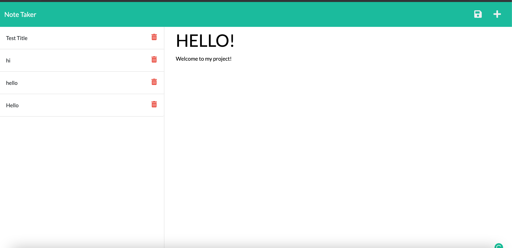

# Note Taker 
   
  * [Information](#information)
  * [Installation](#installation)
  * [Usage](#usage)
  * [Usefulness](#usefulness)
  * [Test](#test)
  * [Questions](#questions)
  * [License](#license)
  
  # Information
  ~ there is Information, Installation, Usage, Usefulness, Test, Questions and License
  

  # Installation
  ~ The project will be created using inquirer, as well as routes through node. It will be created through JavaScript.

  Use https://github.com/connerc11/Note-Taker in order to clone the project!
  
  # Usage
  ~ The project will be useful for generating notes and being able to save notes through local storage.

  You can access the project through https://note-taker1001.herokuapp.com/
  # Usefulness
  ~ This project will be useful for storing information or keeping track of to do items for the day. It is important to incorporate important notes that can be used for later.
  # Test 
  ~ It will be tested through node and will be developed in the back end mixed with the front end through Routes. This will help generate a page to complete information. 
  # Questions
   This will be standard for setting up a design team online.
  * Feel free to reach out to my email: hello1234@gmail.com
  * To see more of my work check out my github! The username is: connerc11
  * Also click the link to have easy access to the Github! (https://github.com/connerc11)
  # License
   
